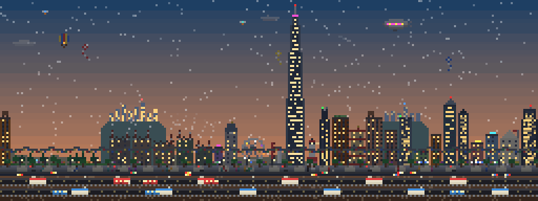
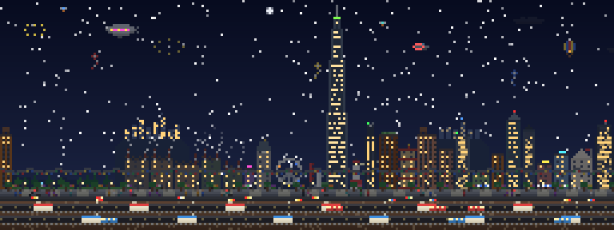
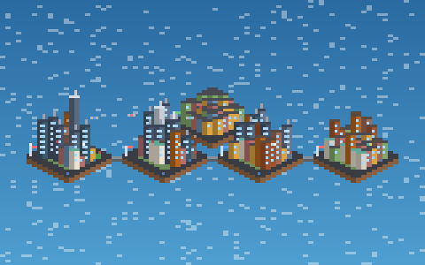

# Code City

An idle pixel-art city for [Claude Code](https://claude.com/claude-code). It lives in a side pane and grows while you work: every prompt brings new citizens, every edit earns bricks, every command powers a factory, and the tokens you use buy landmarks, from a bed of flowers all the way up to a Dyson swarm.



Each project gets its own city. Sessions in the same project build it together, sessions in other projects show up as skylines on the horizon, and the map shows every city you've built as an island in the same sea.

## Install

In a Claude Code terminal session:

```
/plugin install code-city --marketplace verdantran/code-city
```

Answer `y` to add the marketplace, then pick a scope (user scope makes it available in every project). Type `/city` whenever you want to see your city.

### Opening it automatically

By default the pane only opens when you type `/city`, so it never appears in a project unless you ask for it. To have it open at the start of every session instead, turn on **Open the city at the start of every session**. The install offers this setting, and you can change it later in `/config`. Even with it on, the pane only opens by itself in terminals wide enough to fit it beside the conversation.

## Commands and keys

| Command or key | What it does |
| --- | --- |
| `/city` | Open the pane and show the city's size and balance |
| `/city shop` | Open the shop under the city |
| `/city buy <item>` | Buy by exact name or a unique prefix of 3+ letters, e.g. `/city buy ferris` |
| `/city map` | Switch between the street and the map of all your cities |
| `s` / `v` / `z` | Shop, map and zoom |
| An item's key | Buy that item while the shop is open (each button shows its key, e.g. `a: 150k`) |

The keys work once the pane has the keyboard: click it, or press `ctrl+x tab`. You can also click any button.

## How your city grows

Your work feeds the city:

| You... | The city gets |
| --- | --- |
| Send a prompt | 2 new citizens and a few bricks |
| Edit a file | Bricks, more for bigger edits |
| Create a file | Bricks and a new citizen |
| Run a shell command | Power, which builds factories |
| Run tests that pass | A rainbow, and a new park |
| Run a command that fails | A brief shower |
| Make a commit | Fireworks |
| Launch a subagent | A drone that flies over the city while it works, and a new citizen |
| Use tokens | A balance to spend in the shop (cache reads count a tenth, matching how they're billed) |

Between your actions the city keeps building on its own: cranes raise new floors, empty lots fill with houses, shops and towers, and citizens bring in a trickle of bricks. As it grows it moves up through six sizes:

| Size | Citizens |
| --- | --- |
| Campsite | 0 |
| Hamlet | 10 |
| Village | 30 |
| Town | 80 |
| City | 200 |
| Metropolis | 500 |

At Town size a subway starts tunnelling under the street, with stations and trains; at 300 citizens a second line follows.

## Life on the street

The city has a life of its own:




- **Day and night.** A day lasts four minutes. The sun and moon cross the sky, stars come out, and windows light up after dark.
- **Seasons.** These follow the real calendar: blossom drifts past in spring, leaves fall in autumn, and in winter snow settles on the roofs and the street trees go bare.
- **Weather.** Clouds, rain, storms, fog, snow, and on clear winter nights the odd aurora.
- **People.** Pedestrians walk the pavements and put up umbrellas in the rain, with fewer out at night or in bad weather. Commuters come and go from the subway.

## The shop

The tokens you use pile up as a balance, and the shop turns them into things for your city. There are 33 items, from 25k to 2B tokens:

- **Street life:** flower beds, benches, a food truck, bunting, trees and lamps.
- **Landmarks:** a fountain plaza, a lighthouse, a Ferris wheel, a wind turbine, a stadium, a castle, a rocket pad that launches every few minutes, a glass pyramid, a biodome, a supertall and a space elevator.
- **In the sky:** songbirds, kites, a hot-air balloon, an airport, a monorail, an airship, a meteor shower, a flying saucer, a space station, a moon base, an orbital ring and a Dyson swarm.
- **Upgrades:** the **Brickworks** (+50% bricks from edits), **City hall** (doubles idle income) and the **Express subway** (tunnels dig twice as fast, and trains run faster).

The pane's header always shows your balance and either how many items you can afford or how far you are from the next one.

## Other cities

Each project folder has its own city, and they all know about each other.

- **Several sessions in one project** share a single city. Everything any of them earns goes into it, and one session at a time does the building, handing over automatically when it closes. The line above the picture shows how many sessions are here.
- **Sessions in other projects** appear on the street view as skylines on the distant hills, up to four at a time. A neighbour's windows flicker while its session is working, and their names are listed under the picture, with whether each is working or idle and how many drones it has out.
- **The map** (`v`, or `/city map`) shows up to 40 of your most recently active cities as islands, biggest first. Each island flies a flag, and yours is marked. A flag blinks while a session there is working, and its drones fly back and forth overhead. Press `z` to zoom between near, mid and far.



Only names, sizes and skyline shapes are shared between sessions, never what you're working on. See below for exactly what's stored.

## If the colours look grey

The city is drawn in 24-bit colour. If your terminal only reports 256 colours, the dark and muted shades (the night sky, buildings after dark) get rounded to greys, while bright colours like lit windows survive. This is common in WSL under Windows Terminal, which supports full colour but doesn't say so. Add this to your `~/.bashrc` (or your shell's equivalent) and restart Claude Code:

```sh
export COLORTERM=truecolor
```

## What it stores, and where

Nothing is ever written inside your projects. Everything lives under your home folder:

| Path | Contents |
| --- | --- |
| `~/.claude/code-city/cities/<project-path>--<hash>/` | Each project's city: buildings, counters and token totals, plus a small lock file and one earnings file per session (numbers only) |
| `~/.claude/code-city/presence/<id>.json` | Each running session's project name, city size, whether it's working right now and the types of any running subagents, so sessions can see each other. `<id>` is a random ID the plugin makes up, not Claude Code's session ID. Blanked when the session ends. |
| `~/.claude/plugins/store/code-city_*.json` | A private backup of each city, keyed by project path |

No prompts, code, commands, file contents, file names or subagent task descriptions are written to disk. What is written still says something about how you work, though:

- **Which projects you work on.** Folder names are made from each project's full path, so they include your username and the project's location.
- **How much and when.** Each city keeps totals of tokens used and of prompts, edits and commands, with timestamps for when it was founded and when each session last checked in.

None of this leaves your computer, but anyone who can read your home folder can see it. On a computer shared with other accounts, `chmod 700 ~/.claude/code-city` keeps these files private to you.

## AI Generated Code

Code City was written using Claude Code. AI-written code can contain mistakes that look plausible, so please treat this plugin like any other code from the internet: read it before you run it.

What has been done to check it:

- An automated test suite (`claude plugin test .`) covers the game logic, the shop, syncing between sessions, and how the plugin handles damaged or unexpected files.
- `claude plugin validate .` passes. It lists every event the plugin hooks into and every capability it uses.
- The code was security reviewed several times with Claude Code.

None of that replaces your own judgement. A plugin runs inside Claude Code with your permissions, so before installing it, check that it does what it says. As a starting point, the plugin is designed to:

- only watch your session to keep score, never changing your prompts, Claude's tool calls or results, or the model's replies;
- make no shell, network or model calls;
- write only inside `~/.claude/code-city` and its own backup in Claude Code's plugin store (see the table above).

The quickest way to confirm this is to run `claude plugin validate .` on a clone and read its report, then skim `hooks/register.tsx`, where every hook is registered. If anything looks wrong, please open an issue.

## Uninstall

From a terminal:

```sh
claude plugin uninstall code-city
```

To remove its data as well, delete `~/.claude/code-city` and `~/.claude/plugins/store/code-city_*.json`.

## Development

The plugin is a hooks module (`hooks/register.tsx`) with plain TypeScript helpers alongside it. To run a working copy:

```sh
git clone https://github.com/verdantran/code-city.git
claude --plugin-dir ./code-city
```

Claude Code writes the API type declarations into `.claude-plugin/types/` when it loads the plugin, after which `tsc -p .` type-checks it.

```sh
claude plugin validate .
claude plugin test .
```

## License

MIT, see [LICENSE](LICENSE).
